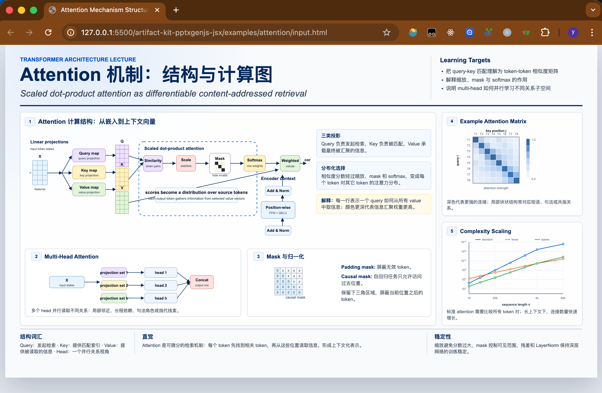
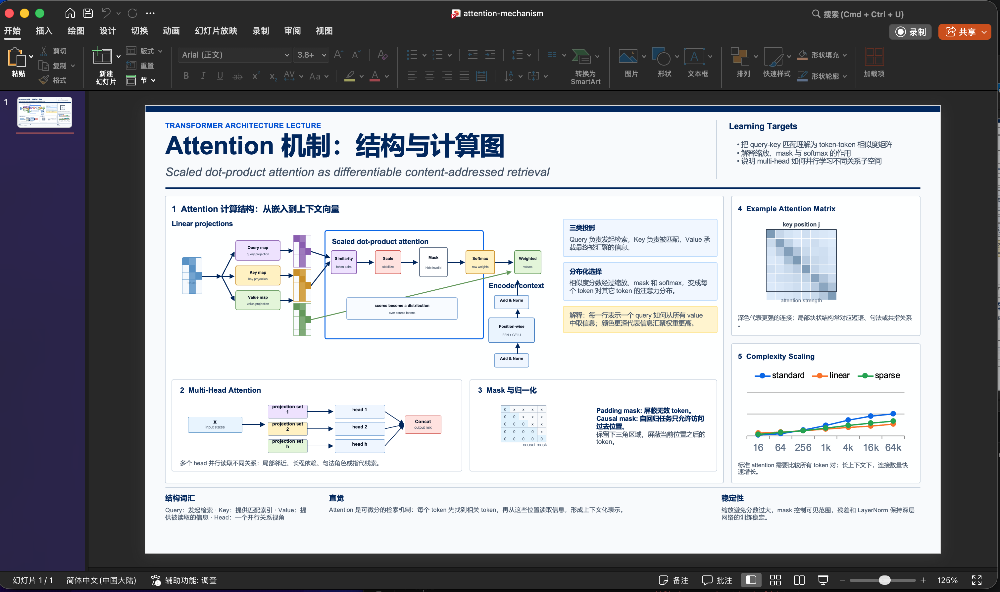
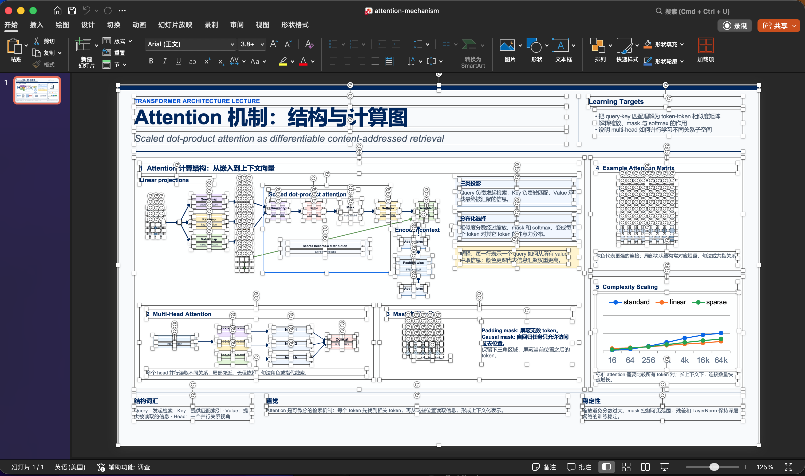

# @artifact-kit/pptxgenjs-jsx

Write editable PowerPoint decks as JSX. Recreate rendered HTML and SVG as native `.pptx` objects when a screenshot is not good enough.

This package wraps [PptxGenJS](https://gitbrent.github.io/PptxGenJS/) with an LLM-friendly component model:

- Describe a deck as a readable tree: `<Deck><Slide><Text /></Slide></Deck>`.
- Use dedicated components for text, shapes, images, tables, charts, lines, and raw PptxGenJS escape hatches.
- Validate the structure before writing a file.
- In browser workflows, measure real DOM nodes and map them into PowerPoint coordinates.
- Export editable PowerPoint objects instead of flattening a page into one bitmap.

## What It Can Produce

The attention example is the clearest proof in this repo. It starts with a 1600x900 HTML/Tailwind/SVG lecture slide, measures the rendered DOM in the browser, then rebuilds the slide as editable PowerPoint text, shapes, lines, arrows, chart objects, and diagram parts.

Source HTML:



Generated PPTX preview:



Editable native PowerPoint objects:



Open the exporter at [examples/attention/exporter.html](examples/attention/exporter.html). It exercises DOM measurement, SVG primitive mapping, `LineBetween`, `CustomGeometry`, native chart output, validation, and browser download behavior.

## Install

```bash
pnpm add @artifact-kit/pptxgenjs-jsx
```

## Basic Usage

Use JSX when you already know the slide structure and coordinates:

```tsx
/** @jsxImportSource @artifact-kit/pptxgenjs-jsx */
import { BarChart, Deck, RoundRect, Slide, Text, renderPptx, validateDeck } from "@artifact-kit/pptxgenjs-jsx";

const deck = (
  <Deck title="Q1 Review" layout={{ name: "WIDE", width: 13.333, height: 7.5 }}>
    <Slide background={{ color: "FFFFFF" }}>
      <RoundRect x={0.7} y={0.6} w={3.8} h={0.6} fill={{ color: "EEF2FF" }} />
      <Text x={0.9} y={0.78} w={3.4} h={0.3} fontSize={18} bold>Q1 Review</Text>
      <BarChart data={[{ name: "Revenue", labels: ["Jan", "Feb", "Mar"], values: [12, 18, 24] }]} x={6.5} y={1} w={5.5} h={3} />
    </Slide>
  </Deck>
);

const issues = validateDeck(deck);
if (issues.some((issue) => issue.level === "error")) throw new Error(JSON.stringify(issues, null, 2));
await renderPptx(deck, { fileName: "q1-review.pptx" });
```

If you do not want a JSX transform, use `pptxElement(Component, props, ...children)`.

## HTML to Editable PPTX

For local tools and agent-generated exporters, you can write JSX directly in the browser with the IIFE build plus Babel Standalone. This is useful when the source of truth is a rendered HTML page, dashboard, report, or slide-like document.

The workflow is:

1. Keep the source HTML clean.
2. Copy it into an exporter page.
3. Make every slide/page visible in one vertical document.
4. Add `data-ak-slide`, `data-ak-width`, `data-ak-height`, `data-ak-px-per-in`, and `data-ak-measure` markers.
5. On export, call `measureArtifacts({ document })`.
6. Use `readSlideLayout()`, `readPptBox()`, and `readFontPt()` to place native PowerPoint objects.
7. Run `validateDeck()`, then `renderPptx()`.

Minimal browser pattern:

```html
<script src="https://unpkg.com/@artifact-kit/pptxgenjs-jsx/dist/pptxgenjs-jsx.browser.iife.js"></script>
<script src="https://unpkg.com/@babel/standalone/babel.min.js"></script>
<script type="text/babel" data-presets="typescript,react">
  /** @jsx pptxElement */
  const {
    Deck,
    Slide,
    Text,
    measureArtifacts,
    pptxElement,
    readFontPt,
    readPptBox,
    readSlideLayout,
    renderPptx,
    validateDeck,
  } = window.ArtifactKitPptxGenJsx;

  document.querySelector("#export-pptx").addEventListener("click", async () => {
    await measureArtifacts({ document });

    const deck = (
      <Deck title="Measured deck" layout={readSlideLayout("slide-1")}>
        <Slide background={{ color: "FFFFFF" }}>
          <Text {...readPptBox("title-1")} fontSize={readFontPt("title-1")} bold margin={0}>
            {document.querySelector('[data-ak-measure="title-1"]').textContent.trim()}
          </Text>
        </Slide>
      </Deck>
    );

    const issues = validateDeck(deck);
    if (issues.some((issue) => issue.level === "error")) throw new Error(JSON.stringify(issues, null, 2));
    await renderPptx(deck, { fileName: "measured-export.pptx" });
  });
</script>
```

See [examples/browser-jsx.html](examples/browser-jsx.html) for a small browser example and [examples/attention/exporter.html](examples/attention/exporter.html) for the full measure-first HTML-to-PPTX example.

## When To Use It

Use this package when you need:

- Editable PowerPoint files generated from TypeScript, browser tools, or agent-authored code.
- A declarative surface that is easier for LLMs to write and review than ordered imperative calls.
- Native charts, tables, shapes, images, text runs, lines, and custom geometry.
- HTML-to-PPTX reconstruction where layout comes from real browser measurement.
- Machine-readable docs and a component manifest for coding agents.

Do not use it when a single screenshot image is the intended final artifact. This package is most valuable when the generated deck must remain editable.

## Documentation Layout

This repo is organized for both humans and agents:

- [llms.txt](llms.txt): load order and retrieval hints for coding agents.
- [docs/llm/quickstart.md](docs/llm/quickstart.md): default LLM context, always useful.
- [docs/llm/component-selection.md](docs/llm/component-selection.md): component choice table.
- [docs/reference/common-props.md](docs/reference/common-props.md): common PptxGenJS props for text, images, tables, slides, and output.
- [docs/reference/shape-props.md](docs/reference/shape-props.md): shape props and the full shape-name list.
- [docs/reference/chart-props.md](docs/reference/chart-props.md): chart data, axis, label, legend, and style props.
- [docs/reference/all-upstream-props.md](docs/reference/all-upstream-props.md): complete generated upstream reference.
- [docs/measure-contract.md](docs/measure-contract.md): browser DOM measurement contract for HTML-to-PPTX workflows.
- [component-manifest.json](component-manifest.json): machine-readable component manifest.

## Build Outputs

| Output | File |
| :-- | :-- |
| Node ESM | `dist/pptxgenjs-jsx.es.js` |
| Node CJS | `dist/pptxgenjs-jsx.cjs` |
| Browser ESM | `dist/pptxgenjs-jsx.browser.es.js` |
| Browser IIFE | `dist/pptxgenjs-jsx.browser.iife.js` global `ArtifactKitPptxGenJsx` |

## Development

```bash
pnpm install
pnpm docs:generate
pnpm test
pnpm test:attention
```
